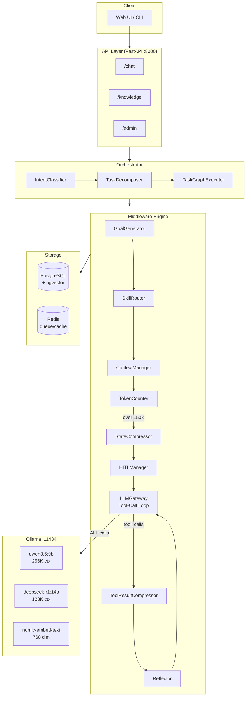
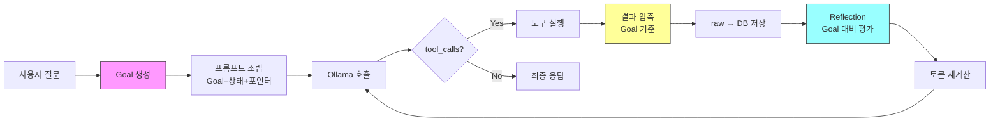
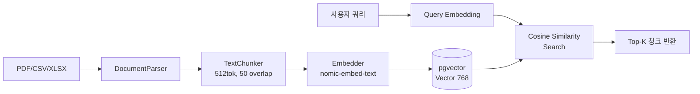
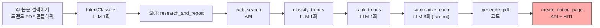

# nano-00-agent

공공 sLLM 에이전트 시스템 — 미들웨어 기반 컨텍스트 관리

## 아키텍처



### Tool-Call 루프 상세



### 지식 파이프라인



### 태스크 분해 예시



## 핵심 흐름

```
사용자 질문
  │
  ▼
[Goal 생성] ─────────────────────────────────────────────┐
  │                                                       │ (Goal은 전 과정에 참조)
  ▼                                                       │
[프롬프트 조립 (Goal+상태+포인터)] → [Ollama 호출] → tool_calls?
                                        ▲        │ Yes    │ No
                                        │        ▼        ▼
                                  [토큰 재계산] ← [도구 실행]  [최종 응답]
                                        ▲        │
                                        │        ▼
                                  [Reflection] ← [결과 압축 (Goal 기준)]
                                  Goal 대비 평가    raw→DB 저장
                                  intent_chain 업데이트
```

## 핵심 설계 원칙

| 원칙 | 설명 |
|------|------|
| **모델은 판단만, 미들웨어가 인프라 전담** | sLLM이 못하는 것(맥락 관리, 토큰 추적)을 모델에 시키지 않음 |
| **Goal 기반 파이프라인** | 매 요청 시 구조화된 Goal 생성 → 전 과정의 판단 기준 |
| **포인터 기반 컨텍스트** | LLM에 raw 데이터 대신 chunk_id + 설명만 전달, 실제 데이터는 DB |
| **구조화 상태 JSON** | 자유 텍스트 요약이 아닌 타입된 JSON (Goal, intent_chain, pointers) |
| **Tool Result 압축** | 20K-40K 토큰 도구 결과를 Goal 기준으로 <4K 토큰으로 압축 |
| **Reflection** | 매 tool call 후 Goal 대비 진행 평가, 이탈 감지 시 재조정 |
| **스킬은 DB 저장** | YAML이 아닌 PostgreSQL — API로 CRUD 가능, 런타임 동적 관리 |
| **태스크 경계 HITL** | 토큰 기반이 아닌 태스크 경계에서 사용자 확인 (150K는 안전망) |

## 기술 스택

| 구성요소 | 선택 |
|---------|------|
| Language | Python 3.12+ |
| API | FastAPI (async) |
| DB | PostgreSQL 17 + pgvector 0.8.2 |
| Queue | Redis 7 + Celery |
| LLM | Ollama — qwen3.5:9b, deepseek-r1:14b |
| Embedding | nomic-embed-text (768 dim) |
| Container | Docker Compose |

## 구조화 상태 JSON 예시

```json
{
  "goal": {
    "final_objective": "AI 연구논문 트렌드 리포트 PDF 생성 + 노션 등록",
    "success_criteria": ["트렌드 3개 이상 분류", "각 트렌드 요약", "PDF 생성"],
    "progress_pct": 50,
    "criteria_status": {"트렌드 3개 이상 분류": "done", "각 트렌드 요약": "in_progress", "PDF 생성": "pending"}
  },
  "intent_chain": [
    "사용자가 AI 연구논문 트렌드 리포트를 요청함",
    "웹 검색 완료 (ptr:tool_result:550e... = Tavily AI논문 10건)",
    "트렌드 분류 완료 [Reflection: Goal 정상 진행]"
  ],
  "accumulated_data": {
    "search_results": {
      "ptr": "ptr:tool_result:550e8400...",
      "desc": "Tavily 웹검색 결과 10건, 압축본 사용 중",
      "token_count_compressed": 3500,
      "token_count_raw": 32000
    }
  },
  "token_budget": {"model": "qwen3.5:9b", "limit": 256000, "threshold": 150000, "used": 48000}
}
```

## 빠른 시작

```bash
# 1. Docker 서비스 시작
docker compose up -d postgres redis

# 2. Ollama 모델 준비
ollama pull qwen3.5:9b
ollama pull nomic-embed-text

# 3. DB 마이그레이션
pip install -e ".[dev]"
alembic upgrade head

# 4. API 서버 시작
uvicorn src.api.app:create_app --port 8000 --factory
```

## 현재 상태

- [x] Phase 1: 기반 (Docker, DB, LLMGateway, /chat, 51 tests)
- [x] Phase 2: 지식 파이프라인 (PDF/CSV/XLSX → 청킹 → 임베딩 → pgvector 검색, 66 tests)
- [ ] Phase 3: 도구/스킬 레지스트리 + 오케스트레이터
- [ ] Phase 4: 컨텍스트 관리 + 상태 압축
- [ ] Phase 5: HITL + 나머지 도구들
- [ ] Phase 6: 안정화
